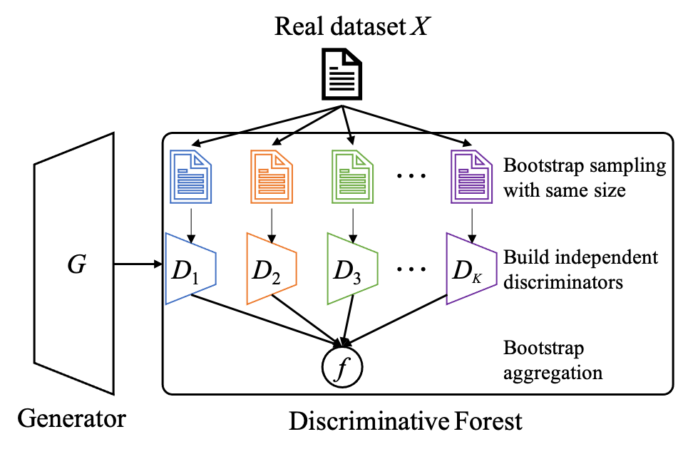

📋 Forest-GAN: Discriminative Forests Improve Generative Diversity for Generative Adversarial Networks

## Abstract
&nbsp;&nbsp;&nbsp;&nbsp; Improving the diversity of Artificial Intelligence Generated Content (AIGC) is one of the fundamental problems in the theory of generative models such as generative adversarial networks (GANs). Previous studies have demonstrated that the discriminator in GANs should have high capacity and robustness to achieve the diversity of generated data. However, a discriminator with high capacity tends to overfit and guide the generator toward collapsed equilibrium. In this study, we propose a novel discriminative forest GAN, named Forest-GAN, that replaces the discriminator to improve the capacity and robustness for modeling statistics in real-world data distribution. A discriminative forest is composed of multiple independent discriminators built on bootstrapped data. We prove that a discriminative forest has a generalization error bound, which is determined by the strength of individual discriminators and the correlations among them. Hence, a discriminative forest can provide very large capacity without any risk of overfitting, which subsequently improves the generative diversity. With the discriminative forest framework, we significantly improved the performance of AutoGAN with a new record FID of 19.27 from 30.71 on STL10 and improved the performance of StyleGAN2-ADA with a new record FID of 6.87 from 9.22 on LSUN-cat.
<div align=center></div>

## Experiments
### Blobs
* Environment
Tensorflow==2.3
```Bash
conda crate -n tensorflow2.3
conda activate tensorflow2.3
pip install tensorflow-gpu==2.3.0
```

* Dataset is preserved in gmm_9blobs.pkl. <br />
* Training 
Blobs-GAN-Disc5.ipynb describes the training step of Forest-GAN, whose variable of **num_disc** represents the number of discrminator in forst.<br />

* Evaluation
We employ two metric of **precision** and **recall** to measure the generative quality and diversity of Forest-GAN. 
There are two key variable in the calculation of Precision and Recall, 
**lambd** and **topk**.
* topk: the K-nearest neighbor sample. We define the distance d_g between each point and its K-nearest neighbor sample.
* lambd: the density constraint.


### STL10

* the soruce code from [AutoGAN](https://github.com/VITA-Group/AutoGAN). Thus, the environment can be seen in **requirement.txt**.
* Training step. The hyper-parameters are set in the file.
```Python
sh autogan_STL10_a_num_disc_FOrest_GAN.sh
```

* Evaluate step. We employ four metric to evaluate performance of Forest-GAN in images of STL10, FID, IS, precision and recall. The following command can generate the metric, but we have to set the value of the variable of __num_disc __, __log_dir__, __load_path__ and __real_images_path  __. 
```Python
sh generate_evaluate.sh
```

### Experiments related to parameters

Forest-GAN is set in four different parameter settings. The parameter in generator remain constant, whereas the key variable of **df_dim** adjusts the number of parameters for the discriminator forest. 

|  df_dim  |  k=1 |  k=2 |  k=5 | k=10 |
|:--------:|:----:|:----:|:----:|:----:|
| Para=1M  |  128 |  92  | 58   |  42  |
| Para=2M  |  186 |  128 | 80   |  58  |
| Para=5M  |  288 |  200 | 128  |  90  |
| Para=10M |  400 |  288 | 178  |  128 |

